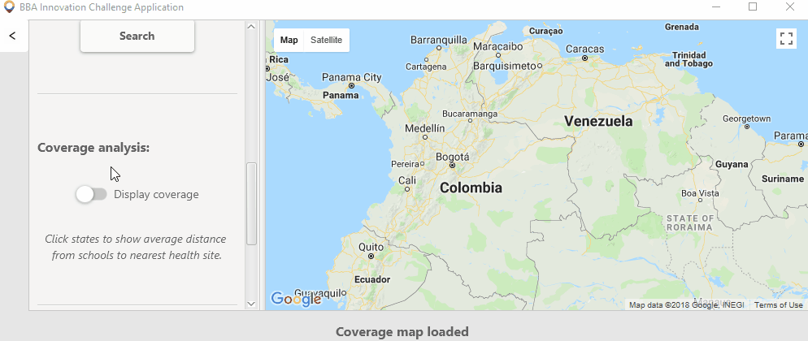

# Colombia Assistant for Planning Public Services (CAPPS)
## Team BBA - 2018 Intern Innovation Challenge
### Emergency Response in Partnership with Unicef

---

This application is intended to help the government of the Republic of Colombia identify
regions most in need of infrastructure and planning
for disaster prevention and response.
It provides information on the location of health facilities and schools in Colombia.

---

### Table of Contents

- [Installation](#installation)
- [How To Use](#usage-guide)
  - [Find Nearest Health Facilities](#find-nearest-health-facilities)
  - [Search Within a Radius](#find-health-facilities-and-schools-within-a-radius)
  - [Clear Map](#clear-map)
  - [Search Location](#search-location)
  - [Coverage Analysis](#coverage-analysis)
  - [Example Usage](#example-usage)
- [Misc](#misc)
---

### Installation
The application can either be built from sources or run precompiled.

#### From source
This application can be built using [maven](https://maven.apache.org/download.cgi). From the command line, in the project folder:
* Run ```mvn install``` to make the jar 
* Run ```java -jar target\CAPPS-1.0-jar-with-dependencies.jar```

To run tests:
* Run ```mvn test``` from the command line

Note: If you have issues with maven not finding the correct compiler, please follow [these](http://roufid.com/no-compiler-is-provided-in-this-environment/) instructions.

#### Precompiled .jar (all dependencies included)

* Download [CAPPS-1.0-jar-with-dependencies.jar](target/CAPPS-1.0-jar-with-dependencies.jar)
* Double click the file to run

---

### Usage Guide

/!\ This application requires an Internet connection to run correctly.

The application uses the centre of the map as the current reference location (e.g. when finding schools within a radius).

##### Find Nearest Health facilities

After positioning the centre of the of the map at the desired location,
clicking the `Find nearest health site` button will move to and mark the nearest
health facility on the map. The application shows the name, coordinates and the distance
of the health facility from the current location.


##### Find Health Facilities and Schools Within a Radius
In the 'find nearby' section, enter desired radius in km in the field and click the `Health site` or `School` button.
The application will show the radius on map and mark health facilities or schools within the radius.
The coordinates, radius and the number of schools will be displayed.


##### Search Location

The `Search` button allows you to search for locations in Colombia - for example, searching 'Hospital de San Jose' will go to the [corresponding hospital in Bogota](http://www.hospitaldesanjose.org.co/).


##### Coverage Analysis

For each state in Colombia, the average distance from each school to the nearest health facility is calculated in kilometres.
This is displayed using the `Display Coverage` control; states in green have a lower average distance (and are thus 'better serviced' by health facilities). This should give an initial insight on which areas need work.
Clicking a state will display the exact average distance.



##### Clear Map

The `Clear Map` button clears the map of markers and other information.


##### Example Usage
The sample below shows steps taken to visualise all schools within a certain radius of the nearest health facility.

---

### Misc
* The provided schools dataset contains information about over 60,000 seemingly random buildings in Colombia, including gas stations, museums, shops etc; it has been filtered down to around 4000 schools by keywords (e.g. 'Escuela'), but some may be missing.
* Formal tests were conducted on the SQL requests - the tests are located in testSQL.java and are self explanatory. Informal tests were conducted on the UI interface to ensure it handles a varying range of user interaction.
