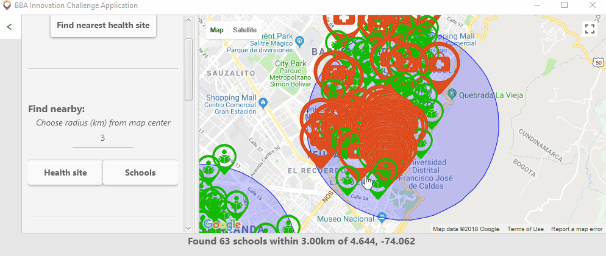
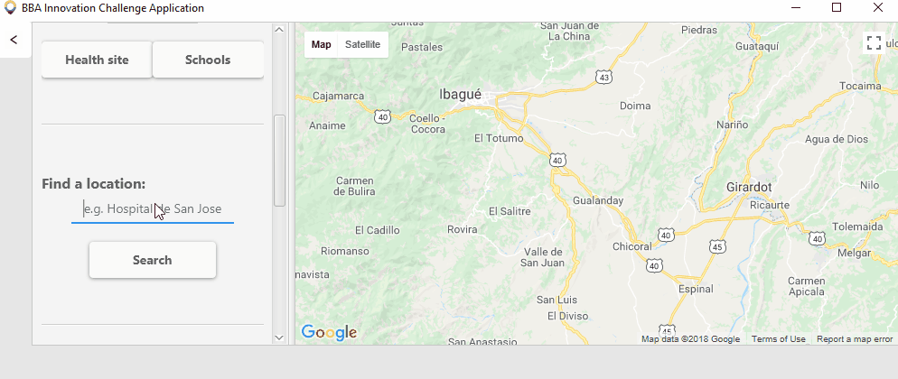

# Colombia Assistant for Planning Public Services (CAPPS)
## Team BBA - 2018 Intern Innovation Challenge
### Emergency Response in Partnership with Unicef

---

In order to help the government of the Republic of Colombia identify
schools most in need of infrastructure and planning
for disaster prevention and response, the application
provides information on the location of hospitals and schools in Colombia.

---

### Table of Contents

- [Installation](#installation)
- [How To Use](#how-to-use)
  - [Find Nearest Hospitals](#find-nearest-hospitals)
  - [Find Hospitals and Schools within a Radius](#find-hospitals-and-schools-within-a-radius)
  - [Clear Map](#clear-map)
  - [Search Location](#search-location)
  - [Heat Map](#heat-map)

---

### Installation
The application can either be installed from sources or run precompiled.

#### From source

This application can be built using maven :
* Run ```maven install``` to make the jar 
* Run the ```CAPPS-1.0-jar-with-dependencies.jar``` as below

To run tests:
* ```maven test```

#### Precompiled .jar (all dependencies included)

* Download CAPPS-1.0-jar-with-dependencies.jar.jar
* Double click the file to run
OR
* Run ```java -jar CAPPS-1.0-jar-with-dependencies.jar.jar```

---

### Usage Guide

/!\ This application requires an Internet connection to run correctly.

The application uses the centre of the map as the current reference location (e.g. when finding schools within a radius)

##### Find Nearest Hospitals

After positioning the centre of the of the map at the desired location,
clicking the `Find Nearest Hospital` button will mark the nearest
hospital on the map. The application shows the name, coordinates and the distance
of the hospital from the current location.


##### Find Hospitals and Schools within a Radius

Enter desired radius in km in the field and click the `Find Hospital` or `Find School` button.
The application will show the radius on map and mark hospitals or schools within the radius.
The coordinates, radius and the number of schools are will be displayed.


##### Clear Map

The `Clear Map` button clears the map of markers.



##### Search Location

The `Search` button allows you to search for locations in Colombia - for example, searching 'Hospital de San Jose' will go to the [corresponding hospital in Bogota](http://www.hospitaldesanjose.org.co/).



##### Coverage Analysis

For each state in Colombia, the average distance from each school to the nearest healthsite is calculated in km.
This is displayed using the `Display Coverage` button; states in green have a lower average distance (and are thus 'better serviced' by health services).
Clicking a state will display the exact average distance.


---
